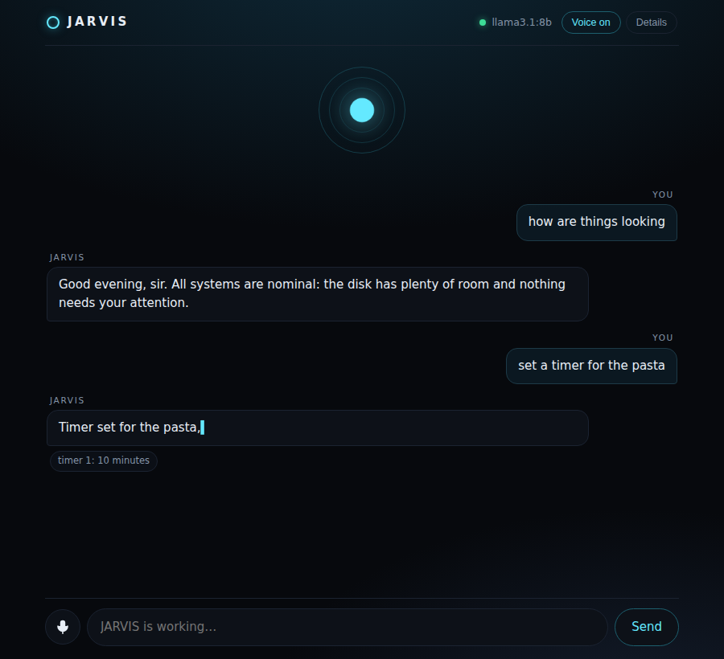

# JARVIS

A voice assistant that runs on your own machine. Open the app, talk to it, and
it answers out loud — running tools on your computer when the answer needs
actually looking rather than guessing.

No API key. No cloud model. Nothing to sign up for.

```bash
ollama pull llama3.1:8b        # the brain
pip install -e .               # no dependencies beyond Python
jarvis                         # opens the app
```



## What it is

A local web app (`jarvis`) with a Python backend. Type or talk; replies stream
back and are spoken as they arrive. The model runs in Ollama alongside it, so
the whole thing works on a plane.

| Piece | What it does |
|---|---|
| App at `127.0.0.1:8765` | Chat UI, voice in and out, tool activity, memory |
| Model backend | Ollama by default; any OpenAI-compatible server instead |
| Tools | Shell, files, timers, memory, system status, web search |
| Memory | Durable facts in a JSON file you can read and edit |

## Install

```bash
# 1. A model that can call tools
curl -fsSL https://ollama.com/install.sh | sh     # if you don't have it
ollama pull llama3.1:8b                           # or qwen2.5:7b, mistral-nemo

# 2. JARVIS
git clone https://github.com/montanrandy4-pixel/jarvis && cd jarvis
pip install -e .

# 3. Check and run
jarvis doctor
jarvis
```

`jarvis doctor` verifies the model server is up, the model is pulled, and that
it supports tool calling — it names the exact command to fix whatever is
missing.

### Using a different server

```bash
jarvis --backend openai --base-url http://localhost:8080/v1 --model local-model
jarvis --backend openai --base-url https://api.groq.com/openai/v1 --model llama-3.3-70b
```

Anything speaking the OpenAI chat-completions protocol works: llama.cpp, vLLM,
LM Studio, text-generation-webui, or a hosted service. Set the key in the
environment variable named by `api_key_env` (default `OPENAI_API_KEY`).

## Commands

| Command | What it does |
|---|---|
| `jarvis` / `jarvis app` | Open the app |
| `jarvis chat` | Talk to it in the terminal |
| `jarvis ask "..."` | One question, answer to stdout |
| `jarvis listen` | Hands-free voice in the terminal, no browser |
| `jarvis memory` | Show, add or delete what it remembers |
| `jarvis doctor` | Check the setup |

Flags work before or after the subcommand: `--backend`, `--model`, `--base-url`,
`--shell off|confirm|on`, `--no-web`, `--port`, `--no-browser`, `--debug`.

## Talking to it

The app uses your browser's speech engines, so voice needs no extra install.

- **Tap the orb** (or the microphone) and speak. Tap again while it is talking
  to interrupt.
- **Hands-free**: turn on *Listen for "hey jarvis"* in Details, and it waits for
  the wake word. Say "hey jarvis, what's on my disk" in one breath and it skips
  straight to the question.
- **Replies are spoken as they stream**, sentence by sentence, so it starts
  talking before it has finished thinking.
- **Reasoning is hidden.** Models that emit `<think>` blocks have them stripped
  before anything is shown or spoken.

Speech recognition in Chrome and Edge goes through the browser's own online
service. If you want speech to stay local too, `jarvis listen` runs the wake
word and Whisper on your machine instead — `pip install -e '.[voice]'`.

## Tools

| Tool | Notes |
|---|---|
| `run_shell` | Gated by the `shell` setting (below) |
| `read_file`, `write_file`, `list_directory` | Confined to the workspace roots |
| `web_search`, `fetch_url` | DuckDuckGo, no API key |
| `remember`, `recall`, `forget` | Durable facts |
| `set_timer`, `list_timers`, `cancel_timer` | Announced out loud when they fire |
| `system_status` | Uptime, load, memory, disk, battery |

### Safety

JARVIS can run commands on your machine, so two gates are on by default:

- **`shell = confirm`** — read-only commands (`ls`, `df`, `git status`) run
  freely; anything that might change something shows a permission card with the
  exact command and waits for you. The classifier errs toward asking: unknown
  commands, pipes, redirects and substitutions all count as writes.
  `shell = off` removes the tool entirely; `shell = on` stops asking.
- **Workspace confinement** — file tools only touch `workspace` (your home
  directory by default), resolved before the check so `../..` cannot climb out.

The app binds to `127.0.0.1` and holds one conversation. Memory, transcripts and
settings live in `~/.local/state/jarvis`.

## Configuration

`JARVIS_*` environment variables or `~/.config/jarvis/config.toml`:

```toml
[jarvis]
backend = "ollama"
model = "llama3.1:8b"
temperature = 0.6
context_tokens = 8192
shell = "confirm"
workspace = ["~/projects", "~/Documents"]
address_user_as = "sir"
port = 8765
```

See `.env.example` for the full list.

### Choosing a model

It must support tool calling — `jarvis doctor` checks and says so. `llama3.1:8b`
is a good default; `qwen2.5:7b` is faster on modest hardware; a 3B model is
quick but will misuse tools. Bigger models answer better and speak later: for a
voice assistant, latency is most of the experience.

## Adding a tool

```python
from jarvis.tools import Tool, ToolResult

Tool(
    name="lights",
    description="Turn a room's lights on or off.",
    input_schema={
        "type": "object",
        "properties": {
            "room": {"type": "string"},
            "on": {"type": "boolean"},
        },
        "required": ["room", "on"],
        "additionalProperties": False,
    },
    handler=lambda room, on: ToolResult(f"{room} lights {'on' if on else 'off'}"),
    mutates=True,                       # ask before doing it
    summarize=lambda a: f"turn the {a['room']} lights "
                        f"{'on' if a['on'] else 'off'}",
)
```

Register it in `jarvis/tools/__init__.py:build_registry`. Inputs are validated
against the schema before the handler runs — small models emit malformed
arguments often enough that this matters — and a handler that raises becomes an
error the model can recover from rather than a crash.

## Development

```bash
pip install -e '.[dev]'
pytest                    # 166 tests, no model or microphone required
```

The agent loop runs against a scripted fake backend; the Ollama and
OpenAI-compatible clients run against a stub HTTP server that replays real
protocol traffic; the app's endpoints are tested over real HTTP, including the
permission round trip.

### Layout

```
src/jarvis/
  server.py     the app: HTTP, SSE streaming, permission prompts
  web/          the UI (no build step, no CDN)
  agent.py      conversation loop, tool execution, history trimming
  backends/     ollama + openai-compatible clients, built on urllib
  persona.py    system prompt
  memory.py     durable facts
  tools/        registry, validation, and the built-in tools
  voice.py      terminal voice mode (local wake word + whisper)
  audio/        mic, VAD, whisper, speech synthesis
```

## Running a shop

The repository also contains a Shopify autopilot that uses the same local
model: it turns a supplier feed into listings, keeps prices and stock in step,
and triages orders. When it is configured, JARVIS gains read-only tools for it,
so you can ask how the shop is doing out loud.

```bash
shop init && shop doctor && shop plan
```

See [SHOP.md](SHOP.md) — including what it deliberately will not do.

## Building a game

`game/` holds a Roblox tycoon built alongside this repo — a service-based
architecture with session-locked saving and a monetization pipeline that is
wired in from the start rather than bolted on.

```bash
rojo serve game/default.project.json
```

See [game/README.md](game/README.md) for the architecture and the phase plan.

## Limitations

- Small local models call tools less reliably than frontier ones. If it ignores
  a tool, try `llama3.1:8b` or a larger model before assuming a bug.
- Browser speech recognition is not local (see above), and Safari and Firefox
  support it poorly. Typing always works.
- Web search scrapes DuckDuckGo's HTML, which can break without warning; it
  fails as a tool error rather than a crash.
- The shell classifier is a heuristic, not a sandbox. `shell = off` is the only
  hard guarantee.

## License

MIT
